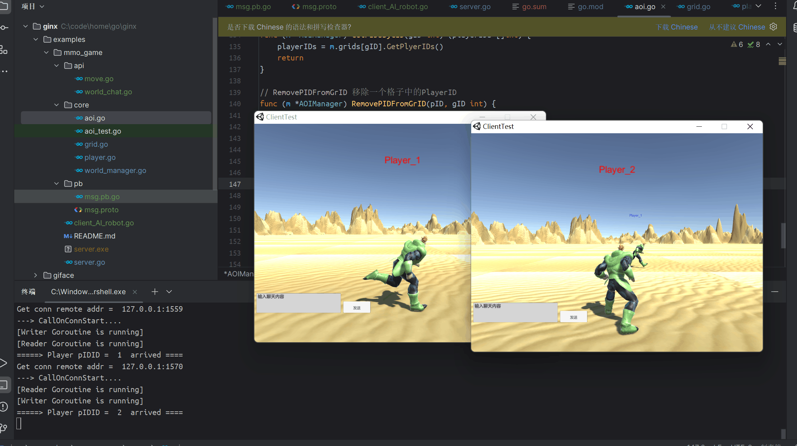

# MMO游戏

# 服务器应用基础协议

| MsgID | Client      | Server      | 描述                                                         |
| ----- | ----------- | ----------- | ------------------------------------------------------------ |
| 1     | -           | SyncPid     | 同步玩家本次登录的ID(用来标识玩家)                           |
| 2     | Talk        | -           | 世界聊天                                                     |
| 3     | MovePackege | -           | 移动                                                         |
| 200   | -           | BroadCast   | 广播消息(Tp 1 世界聊天 2 坐标(出生点同步) 3 动作 4 移动之后坐标信息更新) |
| 201   | -           | SyncPid     | 广播消息 掉线/aoi消失在视野                                  |
| 202   | -           | SyncPlayers | 同步周围的人位置信息(包括自己)                               |


# 运行

```
git clone https://github.com/go-ll/ginx
cd ginx/examples/mmo_game
go mod tidy
go run server.go

                                        
  ____ _
 / ___(_)_ __ __  __
| |  _| | '_ \\ \/ /
| |_| | | | | |>  <
 \____|_|_| |_/_/\_\

┌──────────────────────────────────────────────────────┐
│ [Github] https://github.com/go-ll/ginx                    │
└──────────────────────────────────────────────────────┘
[Ginx] Version: 1.000000, MaxConn: 1024, MaxPacketSize: 1024
Add api msgID =  2
Add api msgID =  3
[START] Server name: ginx,listenner at IP: 0.0.0.0, Port 8999 is starting
Worker ID =  0  is started.
Worker ID =  2  is started.
Worker ID =  5  is started.
Worker ID =  3  is started.
Worker ID =  4  is started.
Worker ID =  7  is started.
Worker ID =  6  is started.
Worker ID =  8  is started.
Worker ID =  9  is started.
Worker ID =  1  is started.
start ginx server   ginx  succ, now listenning...
```


# 预览



